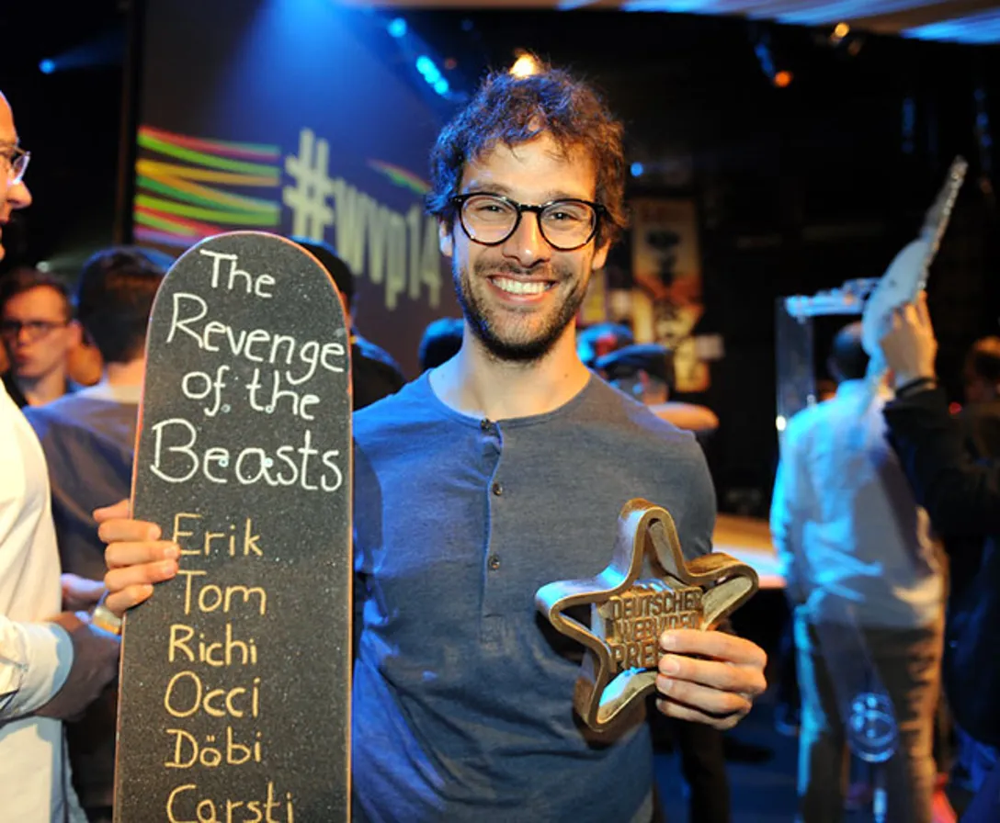
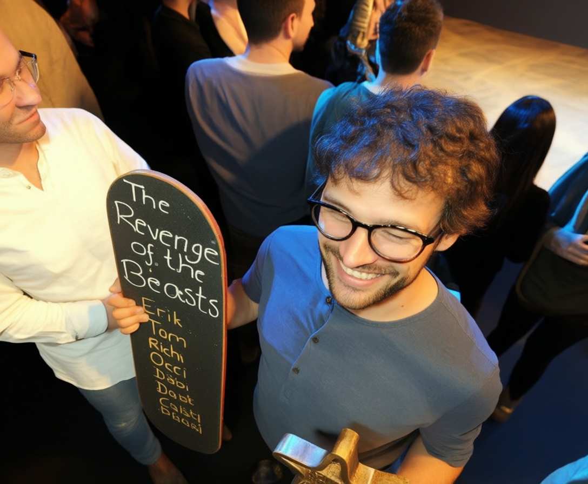
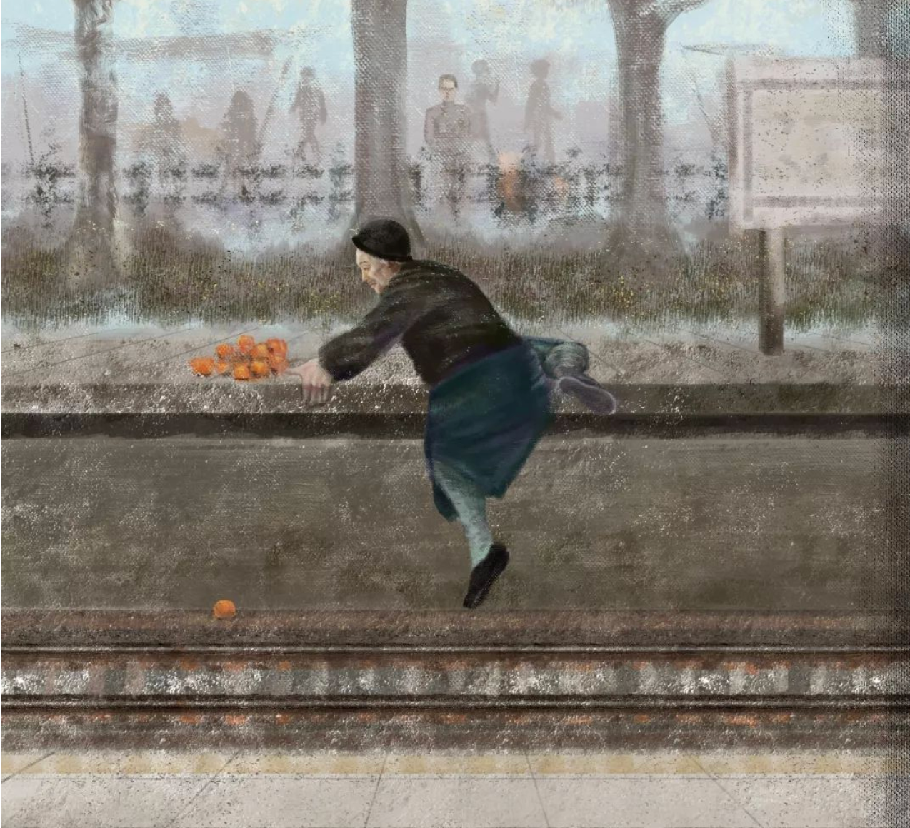
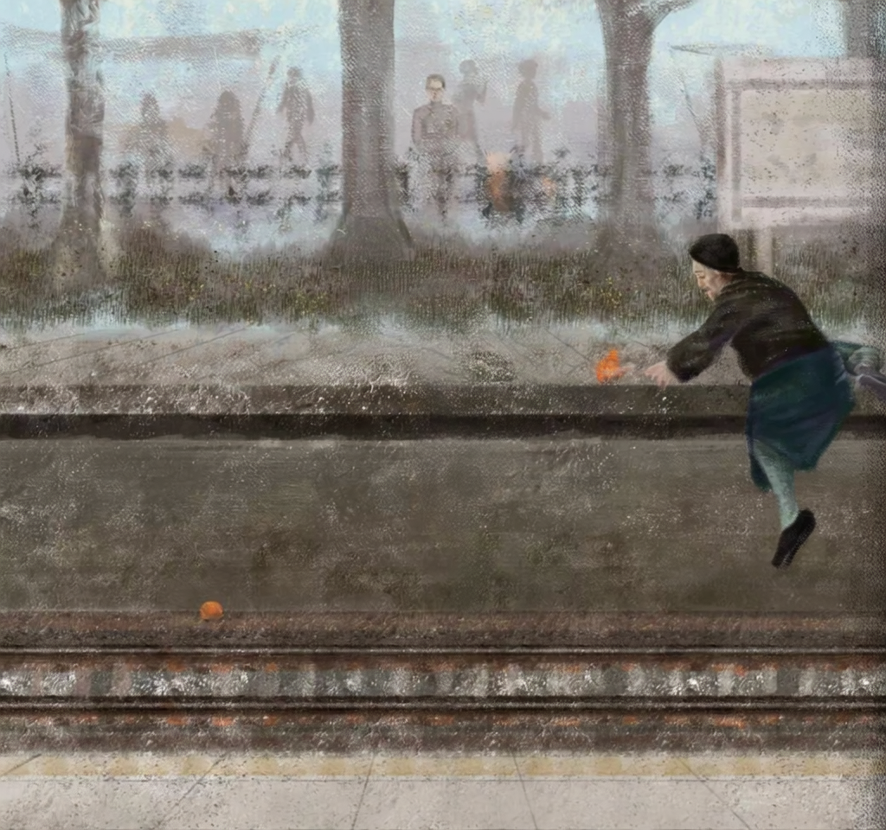
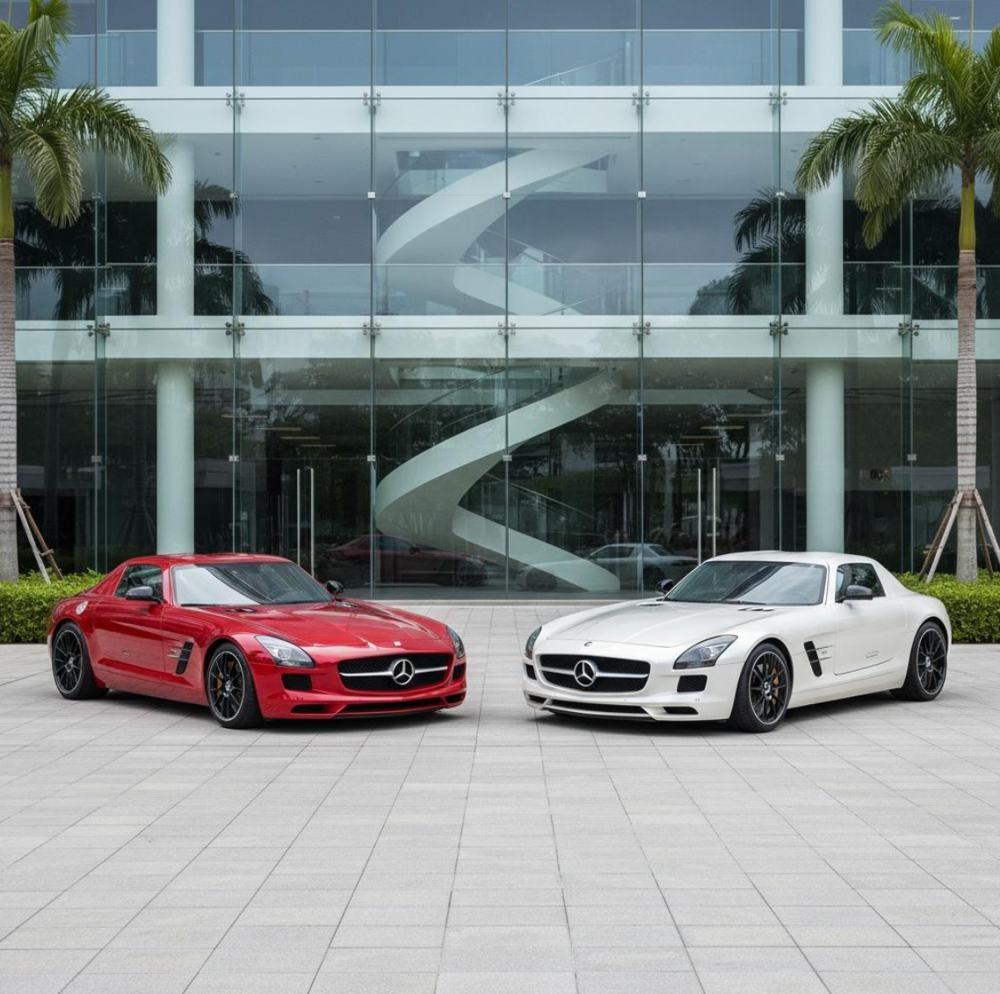
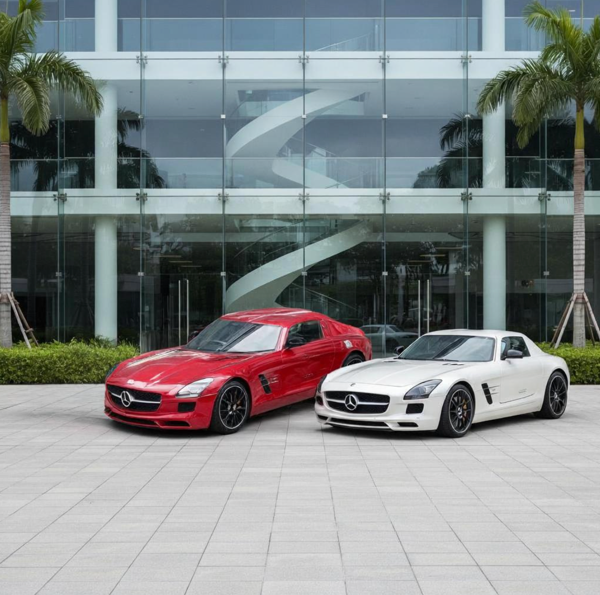

<h1 align="center">JoyAI-Image<br><sub><sup>Awakening Spatial Intelligence in Unified Multimodal Understanding and Generation</sup></sub></h1>

<div align="center">

[](https://joyai-image.s3.cn-north-1.jdcloud-oss.com/JoyAI-Image.pdf)
[](https://github.com/jd-opensource/JoyAI-Image)
[](https://huggingface.co/jdopensource/JoyAI-Image-Edit)&#160;
[](https://modelscope.cn/models/jd-opensource/JoyAI-Image-Edit)&#160;
[](https://huggingface.co/spaces/stevengrove/JoyAI-Image-Edit-Space)&#160;
[](LICENSE)

</div>

## 🔥🔥🔥 News!!
* 2026.04.06: 🎉 The demo for spatial editing is released at [Demo](https://huggingface.co/spaces/stevengrove/JoyAI-Image-Edit-Space).
* 2026.04.02: 🎉 We release the JoyAI-Image-Edit weights. Please Check at [Huggingface](https://huggingface.co/jdopensource/JoyAI-Image-Edit).


## 🐶 JoyAI-Image

JoyAI-Image is a **unified multimodal foundation model** for image understanding, text-to-image generation, and instruction-guided image editing. It combines an 8B Multimodal Large Language Model (MLLM) with a 16B Multimodal Diffusion Transformer (MMDiT). A central principle of JoyAI-Image is the **closed-loop collaboration between understanding, generation, and editing**. Stronger spatial understanding improves grounded generation and contrallable editing through better scene parsing, relational grounding, and instruction decomposition, while generative transformations such as viewpoint changes provide complementary evidence for spatial reasoning.


## 💎 Highlights

- **Unified multimodal foundation**: one model family for understanding, generation, and editing through a shared MLLM-MMDiT interface.
- **Practical data and training recipe**: a scalable pipeline with spatial understanding data ([OpenSpatial](https://github.com/VINHYU/OpenSpatial)), long-text rendering data, editing data ([SpatialEdit](https://github.com/EasonXiao-888/SpatialEdit)), and multi-stage optimization strategies.
- **Awakened spatial intelligence**: stronger spatial understanding, controllable spatial editing, and novel-view-assisted reasoning through a bidirectional loop between understanding and generation.
- **Advanced visual generation**: strong long-text typography, layout fidelity, multi-view generation, and controllable editing with better preservation of scene structure.

## 📦 Model Zoo

| Models               | Task                     | Description                                                                 | Download Link   |
|----------------------|--------------------------|--------------------------------------------------------------------|-----------------|
| JoyAI-Image-Und  | Multimodal Understanding | A text–image understanding backbone that enables high-fidelity spatial reasoning and editing-aware perception. | 🤗[Hugging Face](https://huggingface.co/jdopensource/JoyAI-Image-Edit/tree/main/JoyAI-Image-Und)              |
| JoyAI-Image-Edit        | Image Editing            | An instruction-guided image editing model with precise and controllable spatial manipulation. | 🤗[Hugging Face](https://huggingface.co/jdopensource/JoyAI-Image-Edit)🤖[ModelScope](https://modelscope.cn/models/jd-opensource/JoyAI-Image-Edit)            |
| JoyAI-Image-Edit-Distilled      | Image-Editing            | Distilled version of JoyAI-Image-Edit for faster inference | To be released       |
| JoyAI-Image-Edit-Plus       |  Multi-Image Editing      | An instruction-guided model that supports multi-image editing, enabling cross-image composition, consistency, and joint manipulation.  | To be released       |
| JoyAI-Image     | Text-to-Image            | A high-quality text-to-image generation model with strong multi-view consistency. | To be released       |


## 🔍 Visual Overview

### Capability Profile

JoyAI-Image demonstrates broad multimodal performance across understanding, synthesis, and editing, with particular strengths in spatial reasoning, long-text rendering, multi-view generation, and controllable editing.


### Advanced Text Rendering Showcase

JoyAI-Image is optimized for challenging text-heavy scenarios, including multi-panel comics, dense multi-line text, multilingual typography, long-form layouts, real-world scene text, and handwritten styles.


### Multi-view Generation and Spatial Editing Showcase

JoyAI-Image showcases a spatially grounded generation and editing pipeline that supports multi-view generation, geometry-aware transformations, camera control, object rotation, and precise location-specific object editing. Across these settings, it preserves scene content, structure, and visual consistency while following viewpoint-sensitive instructions more accurately.


### Spatial Editing for Spatial Reasoning Showcase

JoyAI-Image poses high-fidelity spatial editing, serving as a powerful catalyst for enhancing spatial reasoning. Compared with Qwen-Image-Edit and Nano Banana Pro, JoyAI-Image-Edit synthesizes the most diagnostic viewpoints by faithfully executing camera motions. These high-fidelity novel views effectively disambiguate complex spatial relations, providing clearer visual evidence for downstream reasoning.


## 🚀 Quick Start

### 1. Environment Setup

**Requirements**: Python >= 3.10, CUDA-capable GPU

Create a virtual environment and install:

```bash
conda create -n joyai python=3.10 -y
conda activate joyai

pip install -e .
```

> **Note on Flash Attention**: `flash-attn >= 2.8.0` is listed as a dependency for best performance.

#### Core Dependencies

| Package | Version | Purpose |
|---------|---------|---------|
| `torch` | >= 2.8 | PyTorch |
| `transformers` | >= 4.57.0, < 4.58.0 | Text encoder |
| `diffusers` | >= 0.34.0 | Pipeline utilities |
| `flash-attn` | >= 2.8.0  | Fast attention kernel |


### 2. Inference

#### 2.1 Image Understanding

```bash
python inference_und.py \
  --ckpt-root /path/to/ckpts_infer \
  --image "test_images/test_1.jpg,test_images/test3.png" \
  --prompt "Compare these two images." \
  --max-new-tokens 1024
```

#### CLI Reference (`inference_und.py`)

| Argument | Type | Default | Description |
|----------|------|---------|-------------|
| `--ckpt-root` | str | *required* | Checkpoint root containing `text_encoder/` |
| `--image` | str | *required* | Input image path, or comma-separated paths for multiple images |
| `--prompt` | str | `"Describe this image in detail."` | User question or instruction. When omitted, defaults to image captioning |
| `--max-new-tokens` | int | 2048 | Maximum number of tokens to generate |
| `--temperature` | float | 0.7 | Sampling temperature. Use `0` for greedy decoding |
| `--top-p` | float | 0.8 | Top-p (nucleus) sampling threshold |
| `--top-k` | int | 50 | Top-k sampling threshold |
| `--output` | str | None | Optional output file to save the response text |

#### 2.2 Image Editing

```bash
python inference.py \
  --ckpt-root /path/to/ckpts_infer \
  --prompt "Turn the plate blue" \
  --image test_images/test_1.jpg \
  --output outputs/result.png \
  --seed 123 \
  --steps 30 \
  --guidance-scale 4.0 \
  --basesize 1024
```

#### CLI Reference (`inference.py`)

| Argument | Type | Default | Description |
|----------|------|---------|-------------|
| `--ckpt-root` | str | *required* | Checkpoint root |
| `--prompt` | str | *required* | Edit instruction or T2I prompt |
| `--image` | str | None | Input image path (required for editing, omit for T2I) |
| `--output` | str | `example.png` | Output image path |
| `--steps` | int | 50 | Denoising steps |
| `--guidance-scale` | float | 4.0 | Classifier-free guidance scale |
| `--seed` | int | 42 | Random seed for reproducibility |
| `--neg-prompt` | str | `""` | Negative prompt |
| `--basesize` | int | 1024 | Bucket base size for input image resizing (256/512/768/1024) |
| `--config` | str | auto | Config path; defaults to `<ckpt-root>/infer_config.py` |
| `--rewrite-prompt` | flag | off | Enable LLM-based prompt rewriting |
| `--rewrite-model` | str | `gpt-5` | Model name for prompt rewriting |
| `--hsdp-shard-dim` | int | 1 | FSDP shard dimension for multi-GPU (set to GPU count) |


### 3. Spatial Editing Reference

JoyAI-Image supports three spatial editing prompt patterns: **Object Move**, **Object Rotation**, and **Camera Control**. For the most stable behavior, we recommend following the prompt templates below as closely as possible.
For more information (including data curation and evaluation strategies), please refer to [SpatialEdit](https://github.com/EasonXiao-888/SpatialEdit).

#### 3.1 Object Move

Use this pattern when you want to move a target object into a specified region.

**Prompt template:**

```text
Move the <object> into the red box and finally remove the red box.
```

**Rules:**

* Replace `<object>` with a clear description of the target object to be moved.
* The **red box** indicates the target destination in the image.
* The phrase **"finally remove the red box"** means the guidance box should not appear in the final edited result.

**Example:**

```text
Move the apple into the red box and finally remove the red box.
```

#### 3.2 Object Rotation

Use this pattern when you want to rotate an object to a specific canonical view.

**Prompt template:**

```text
Rotate the <object> to show the <view> side view.
```

**Supported `<view>` values:**

```
front, right, left, rear, front right, front left, rear right, rear left
```

**Rules:**

* Replace `<object>` with a clear description of the object to rotate.
* Replace `<view>` with one of the supported directions above.
* This instruction is intended to change the **object orientation**, while keeping the object identity and surrounding scene as consistent as possible.

**Examples:**

```text
Rotate the chair to show the front side view.
Rotate the car to show the rear left side view.
```

#### 3.3 Camera Control

Use this pattern when you want to change only the camera viewpoint while keeping the 3D scene itself unchanged.

**Prompt template:**

```text
Move the camera.
- Camera rotation: Yaw {y_rotation}°, Pitch {p_rotation}°.
- Camera zoom: in/out/unchanged.
- Keep the 3D scene static; only change the viewpoint.
```

**Rules:**

* `{y_rotation}` specifies the yaw rotation angle in degrees.
* `{p_rotation}` specifies the pitch rotation angle in degrees.
* `Camera zoom` must be one of: `in`, `out`,`unchanged`
* The last line is important: it explicitly tells the model to preserve the 3D scene content and geometry, and only adjust the camera viewpoint.

**Examples:**

```text
Move the camera.
- Camera rotation: Yaw 45°, Pitch 0°.
- Camera zoom: in.
- Keep the 3D scene static; only change the viewpoint.
```

```text
Move the camera.
- Camera rotation: Yaw -90°, Pitch 20°.
- Camera zoom: unchanged.
- Keep the 3D scene static; only change the viewpoint.
```

#### 3.4 Application

**3D Reconstruction:**

The first and third examples show point clouds with only a single given viewpoint. The second and fourth examples are augmented by [SpatialEdit](https://github.com/EasonXiao-888/SpatialEdit), which synthesizes richer spatial observations from the sparse input view.

<p align="center">
  
  
  
  
</p>

**Conditional-frames Based Video Generation:**

Given the first frame, [SpatialEdit](https://github.com/EasonXiao-888/SpatialEdit) first generates the final frame of the video, and a video generation model then creates a smooth rotational transition between them while maintaining background consistency.

<p align="center">
  
  
  
</p>
<p align="center">
  
  
  
</p>
<p align="center">
  
  
  
</p>

#### 3.5 Demo Display

https://github.com/user-attachments/assets/54cb2fcc-0646-44e9-a002-21a7228501f3


## ⚖️ License Agreement

JoyAI-Image is licensed under Apache 2.0. 

## Acknowledgements

This project builds upon and benefits from the following open-source repositories.

* Wan2.1: https://github.com/Wan-Video/Wan2.1
* HunyuanVideo: https://github.com/Tencent-Hunyuan/HunyuanVideo

Please refer to the respective repositories for their licenses and citation guidelines.


## ☎️  We're Hiring!
We are actively hiring Research Scientists, Engineers, and Interns to join us in building next-generation generative foundation models and bringing them into real-world applications. If you’re interested, please send your resume to: huanghaoyang.ocean@jd.com
